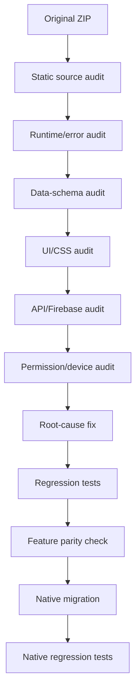
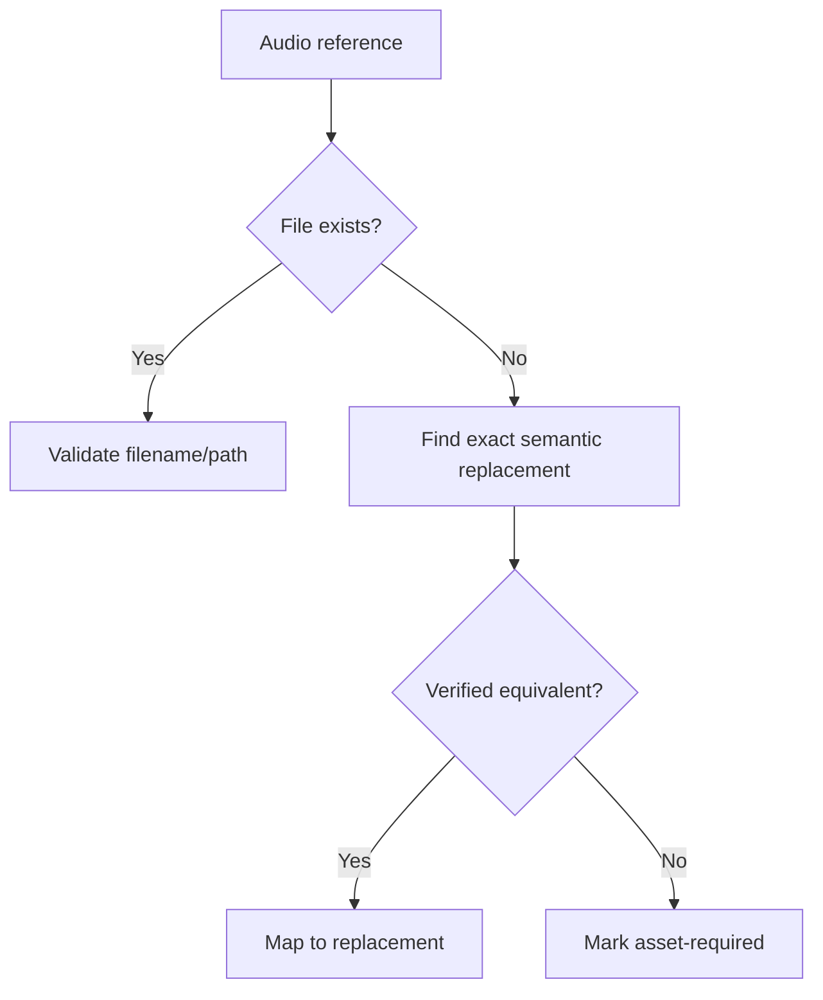
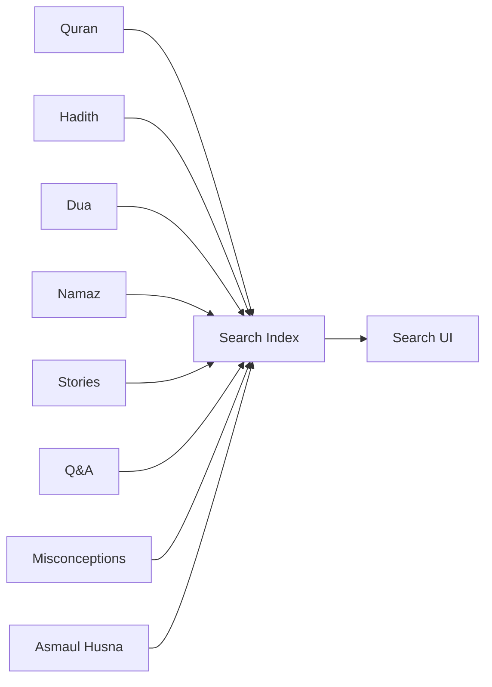
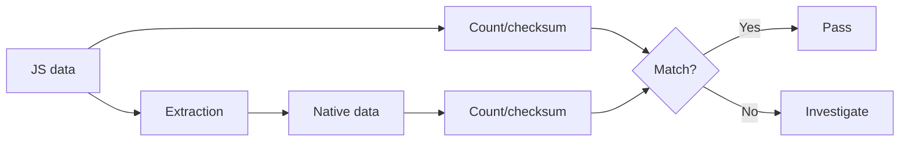
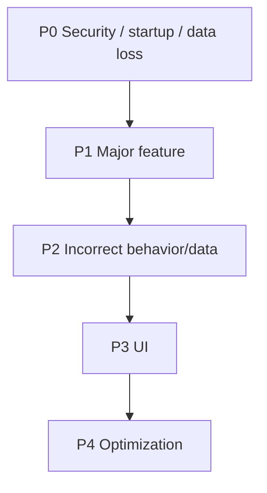
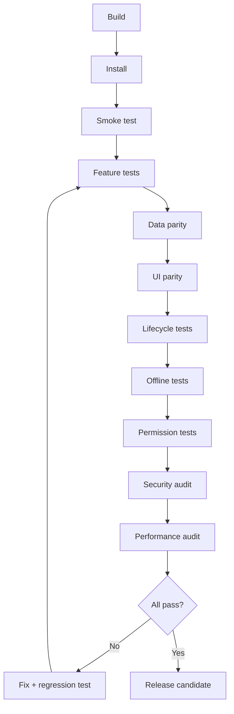

# Islamic Hub — Bug Fix Master Plan

**Scope:** Uploaded `islamic-hub-source.zip`-এর বর্তমান bug/logic/data/UI/runtime সমস্যা শনাক্ত, fix এবং পরে direct-native Android conversion-এর সময় পুনরায় না আসার জন্য একটি complete bug-fix plan।

**Primary rule:** কোনো feature বাদ দিয়ে bug “fix” করা যাবে না। আগে behavior preserve, তারপর root-cause fix, তারপর regression test।

---

## 1. Bug-fix workflow



### Severity

| Level | Meaning | Action |
|---|---|---|
| P0 | App cannot start / critical data loss / security issue | Fix first |
| P1 | Major feature broken | Fix before release |
| P2 | Feature partially broken / wrong result | Fix before final build |
| P3 | UI/minor issue | Fix during polish |
| P4 | Optimization/refactor | Optional after functional parity |

---

# 2. Confirmed/source-indicated bugs to fix

## BUG-001 — `window.namazData` global collision
**Severity:** P1

### Problem
`namaz-data.js` এবং `namazshikkha-data.js` একই global name `window.namazData` ব্যবহার করে কিন্তু data structure আলাদা।

### Impact
- এক file অন্যটার data overwrite করতে পারে
- screen অনুযায়ী wrong object পাওয়া যেতে পারে
- search/detail rendering crash হতে পারে

### Fix
Separate models:

```text
NamazPrayerData
NamazShikkhaData
ExtendedNamazData
NamazExtrasData
```

Native migration-এ কোনো global mutable object ব্যবহার করা যাবে না।

### Test
- Namaz screen
- Namaz Shikkha
- search
- detail page
- audio mapping

---

## BUG-002 — Extended Hadith search wrong field
**Severity:** P1

### Problem
Search logic `topic.items` ধরনের structure ধরে নেয়, কিন্তু source data-তে `topic.hadiths` ব্যবহৃত হচ্ছে।

### Fix

```text
topic.items
      ↓
topic.hadiths
```

তবে hardcoded assumption বাদ দিয়ে typed model ব্যবহার করতে হবে।

### Test
- Hadith topic search
- Arabic text
- Bengali translation
- multiple hadith in same topic
- empty topic

---

## BUG-003 — Islamic Stories search shape mismatch
**Severity:** P1

### Problem
Stories search prophets/khalifas-এর actual array structure-এর সাথে compatible নয়।

### Fix

```text
Stories
 ├── prophets[]
 ├── khalifas[]
 └── other stories[]
```

সব category normalize করে এক search index তৈরি করতে হবে।

### Test
- Prophet search
- Khalifa search
- story search
- partial Bengali search
- English transliteration search

---

## BUG-004 — `meraj` story/search category missing
**Severity:** P2

### Problem
Meraj content থাকলেও search/category registration-এ বাদ পড়ার সম্ভাবনা আছে।

### Fix
Story registry-তে `meraj` explicitly register করতে হবে।

### Test
Search: `meraj`, `মেরাজ`, related title/keywords।

---

## BUG-005 — Q&A search references wrong global
**Severity:** P1

### Problem
Search code `QUESTION_DATA` ব্যবহার করে, কিন্তু source data naming `questionData` / `ansData`-এর সাথে mismatch আছে।

### Fix
একটি typed repository:

```text
QuestionRepository
AnswerRepository
```

Search layer সরাসরি JS global access করবে না।

### Test
- question search
- answer search
- empty result
- partial query
- Bengali query

---

## BUG-006 — Misconceptions search schema mismatch
**Severity:** P1

### Problem
Search implementation expected array/field names source structure-এর সাথে consistent নয়।

### Fix

```text
Misconception
 ├── id
 ├── question/title
 ├── explanation/answer
 ├── keywords
 └── category
```

একটি normalized index বানাতে হবে।

---

## BUG-007 — Asmaul Husna search field mismatch
**Severity:** P2

### Problem
Search `bangla` field ধরে, কিন্তু source data-তে `transliteration` field ব্যবহৃত হচ্ছে।

### Fix
Searchable fields:

```text
arabic
transliteration
bangla meaning
english meaning
keywords
```

### Test
- Arabic
- Bengali
- transliteration
- English

---

# 3. Namaz data/content bugs

## BUG-008 — Surah Fatiha Arabic/content corruption
**Severity:** P1

### Problem
Surah Fatiha-এর `content.arabic` field-এর পরের অংশে Bengali transliteration ঢুকে গেছে।

### Fix
Native migration-এর আগে canonical data validation চালাতে হবে।

```text
Arabic field → Arabic Unicode only
Bangla field → Bengali
Transliteration → Latin/Bengali transliteration
```

### Test
- Arabic rendering
- copy
- search
- audio
- screen reader

---

## BUG-009 — Arabic dua typo/mixed script
**Severity:** P2

Known suspicious value:

```text
نَافْسِي / নাফْسِي
```

Expected canonical Arabic form must be verified before committing the correction.

### Rule
Religious text correction must be source-verified; automated string replacement alone নয়।

---

# 4. Missing audio references

## BUG-010 — Referenced audio files must be verified
**Severity:** P1

Known references:

```text
sana.mp3
takbir.mp3
durood.mp3
janaza_dua_adult.mp3
istikhara_dua.mp3
tarabih_dua.mp3
```

### Fix workflow



**Never** silently remove the related button/feature.

---

# 5. Search system bugs

## BUG-011 — Search fragmentation
**Severity:** P1

Current application has many separate data sources.

### Fix

Create one normalized search pipeline:



Each result must contain:

```text
id
type
title
subtitle
content
keywords
destination
```

### Regression cases

- empty query
- whitespace-only query
- Bengali
- Arabic
- English
- transliteration
- mixed-language
- typo
- no result
- duplicate result
- large result set

---

# 6. Browser/API fallback bugs

## BUG-012 — Browser-vs-native branching
**Severity:** P1 for native migration

Current modules may contain branches such as:

```text
Capacitor available?
    ↓
browser fallback
```

### Problem
Different runtimes can produce different behavior.

### Fix
After native migration:

```text
Android API
   ↓
single implementation
```

No browser fallback should remain in the final Android runtime.

---

# 7. Storage bugs

## BUG-013 — `localStorage` state inconsistency
**Severity:** P1

### Risks
- malformed JSON
- stale keys
- duplicate key naming
- state lost after schema change
- no migration/versioning

### Fix

```text
DataStore → settings/preferences
Room → structured persistent data
```

Add migration/versioning.

### Test
- fresh install
- existing user migration
- app restart
- process kill
- low memory
- upgrade build

---

# 8. Notification bugs

## BUG-014 — Notification scheduling reliability
**Severity:** P1

Must test:

```text
schedule
cancel
reschedule
timezone/date change
location change
custom Jamaat time
device reboot
app update
permission denied
```

Native target:

```text
Prayer calculation
       ↓
AlarmManager
       ↓
NotificationManager
```

Daily/background refresh can use WorkManager where appropriate.

---

# 9. Location bugs

## BUG-015 — Location permission/state handling
**Severity:** P1

Test all states:

```text
granted
denied
denied twice
permanently denied
GPS disabled
network unavailable
location timeout
manual location selected
```

Prayer time and Qibla must never crash if location is unavailable.

---

# 10. Qibla bugs

## BUG-016 — Sensor/orientation instability
**Severity:** P1

Native implementation must handle:

- no magnetic sensor
- sensor accuracy low
- device rotation
- calibration
- location unavailable
- rapid orientation changes
- lifecycle pause/resume

### Formula/data validation

Mecca coordinates:

```text
21.422487, 39.826206
```

Bearing calculation must be unit-tested against known locations.

---

# 11. Camera/scanner bugs

## BUG-017 — Camera lifecycle
**Severity:** P1

Test:

- permission denied
- camera unavailable
- rotation
- background/foreground
- repeated capture
- processing cancellation
- malformed image
- low-memory

CameraX should own the lifecycle.

---

# 12. Microphone/Tajweed bugs

## BUG-018 — Audio capture lifecycle
**Severity:** P1

Test:

```text
permission
start
stop
pause
resume
screen rotation
phone call interruption
another app using mic
no microphone
```

No browser `getUserMedia()` dependency in native build.

---

# 13. AI Scholar bugs

## BUG-019 — Secret exposure
**Severity:** P0/P1 depending on current deployment

`secrets.js` must not become a mechanism for embedding private API keys into the APK.

### Fix

```text
Android app
    ↓
authenticated backend
    ↓
AI provider
```

or another secure provider architecture.

### Test

- no secret in APK resources
- no secret in BuildConfig
- no secret in logs
- timeout
- offline
- rate-limit
- malformed response
- retry

---

# 14. Firebase/sync bugs

## BUG-020 — Local/cloud conflict
**Severity:** P1

Define deterministic rules:

```text
Local change
     ↓
sync queue
     ↓
Firebase
     ↓
conflict resolution
```

Test:

- offline edit
- reconnect
- duplicate update
- deleted item
- account change
- partial sync
- failed sync retry

---

# 15. UI bugs

## BUG-021 — Dynamic DOM state not represented consistently
**Severity:** P1

Any JS-generated:

- modal
- bottom sheet
- drawer
- card
- loading view
- error view
- empty state

must become an explicit native UI state.

### State model

```text
Loading
Success
Empty
Error
PermissionRequired
Offline
```

---

# 16. Bengali/Arabic/RTL bugs

## BUG-022 — Text rendering consistency
**Severity:** P1

Verify:

- Bengali glyphs
- Arabic shaping
- Arabic diacritics
- RTL direction
- mixed Arabic+Bengali
- line wrapping
- justification
- copy/paste
- accessibility

Use native Unicode-aware rendering and proper `textDirection`.

---

# 17. Theme bugs

## BUG-023 — Dark/light state mismatch
**Severity:** P2

Centralize:

```text
ThemeRepository
DataStore
Native Theme
```

No screen should independently read/write theme state.

Test:

- light
- dark
- system
- restart
- rotation
- every major screen

---

# 18. Navigation bugs

## BUG-024 — Back-stack inconsistency
**Severity:** P1

Test:

```text
Home → Feature → Detail → Dialog
Back
Back
Home
Deep link
Notification tap
```

No screen should depend on browser history.

---

# 19. Bookmark bugs

## BUG-025 — Duplicate / stale bookmark
**Severity:** P2

Use stable IDs:

```text
type + sourceId
```

instead of title-only matching.

Test:

- add
- remove
- duplicate add
- restart
- source data update
- search → bookmark → detail

---

# 20. Tracker/streak bugs

## BUG-026 — Date/timezone boundary
**Severity:** P1

Test:

- midnight
- Bangladesh timezone
- missed prayer
- same prayer twice
- date change
- device timezone change
- offline day
- app restart

Use a single timezone-aware date service.

---

# 21. Permission bugs

## BUG-027 — Permission requests scattered across features
**Severity:** P2

Create:

```text
PermissionManager
```

and centralize state handling.

Features should ask for capability, not manipulate permission internals independently.

---

# 22. Performance bugs

## BUG-028 — Large static data loaded eagerly
**Severity:** P2

Avoid loading every Quran/Hadith/story record into UI memory.

Use:

```text
Room / indexed local data
Paging where appropriate
lazy lists
background parsing
```

---

# 23. Memory/leak bugs

## BUG-029 — Lifecycle leaks

Watch for:

- sensor listeners
- location callbacks
- audio player
- camera
- coroutine jobs
- dialogs
- notification receivers

Every resource must be lifecycle-aware.

---

# 24. Crash-proofing

## BUG-030 — Null/malformed data

Every external/local data boundary must validate:

```text
null
empty
wrong type
missing field
invalid URL
invalid date
invalid audio path
invalid location
```

No `!!`-style unchecked assumptions in critical paths.

---

# 25. Data migration validation

Before deleting/replacing the old source, generate:

```text
source record count
native record count
source asset count
native asset count
source audio count
native audio count
searchable category count
```

Example:



---

# 26. Security bug-fix checklist

- [ ] No private API key in APK
- [ ] No secret in logs
- [ ] No plaintext sensitive data
- [ ] Firebase rules reviewed
- [ ] Admin access protected
- [ ] Network TLS enforced
- [ ] Exported Android components reviewed
- [ ] Deep links validated
- [ ] Intent inputs validated
- [ ] Web/backend responses sanitized
- [ ] Debug logging disabled in release

---

# 27. Regression test matrix

| Area | Fresh install | Restart | Offline | Permission denied | Rotation | Upgrade |
|---|---:|---:|---:|---:|---:|---:|
| Home | ✓ | ✓ | ✓ | — | ✓ | ✓ |
| Quran | ✓ | ✓ | ✓ | — | ✓ | ✓ |
| Hadith | ✓ | ✓ | ✓ | — | ✓ | ✓ |
| Namaz | ✓ | ✓ | ✓ | — | ✓ | ✓ |
| Prayer time | ✓ | ✓ | ✓ | ✓ | ✓ | ✓ |
| Qibla | ✓ | ✓ | — | ✓ | ✓ | ✓ |
| Dua | ✓ | ✓ | ✓ | — | ✓ | ✓ |
| Zikr | ✓ | ✓ | ✓ | — | ✓ | ✓ |
| Search | ✓ | ✓ | ✓ | — | ✓ | ✓ |
| Bookmark | ✓ | ✓ | ✓ | — | ✓ | ✓ |
| Tracker | ✓ | ✓ | ✓ | — | ✓ | ✓ |
| Notification | ✓ | ✓ | ✓ | ✓ | — | ✓ |
| Scanner | ✓ | ✓ | — | ✓ | ✓ | ✓ |
| Tajweed | ✓ | ✓ | — | ✓ | ✓ | ✓ |
| AI Scholar | ✓ | ✓ | ✓ | — | ✓ | ✓ |
| App Lock | ✓ | ✓ | — | — | ✓ | ✓ |

---

# 28. Bug-fix order



Recommended order:

1. **P0 security / crash / startup**
2. data-model collisions
3. search/data schema bugs
4. missing asset/audio references
5. prayer/location/Qibla
6. storage/sync
7. notifications
8. camera/microphone
9. AI
10. navigation/state
11. Bengali/Arabic/UI
12. performance
13. polish

---

# 29. Final bug-free acceptance criteria

The project cannot be called fixed until:

```text
No P0
No known P1
All P2 functional bugs resolved
Critical P3 UI bugs resolved
All source datasets validated
All referenced assets validated
All referenced audio validated
All search categories tested
All permissions tested
All native lifecycle paths tested
No WebView/Capacitor dependency in final native runtime
```

## Final gate



---

# 30. Important rule for the native rewrite

**Bug fix ≠ feature removal.**

If a web implementation is broken, the native version must reproduce the intended feature using the correct Android implementation.

Examples:

```text
Broken browser geolocation
        ↓
Native Fused Location

Broken browser notification
        ↓
Native NotificationManager

Broken browser audio
        ↓
Media3

Broken DOM modal
        ↓
Native Dialog/BottomSheet

Broken localStorage
        ↓
DataStore/Room

Broken browser camera
        ↓
CameraX

Broken browser microphone
        ↓
Native audio capture
```

The end result should be **more reliable than the current web implementation while preserving the complete feature set**.
