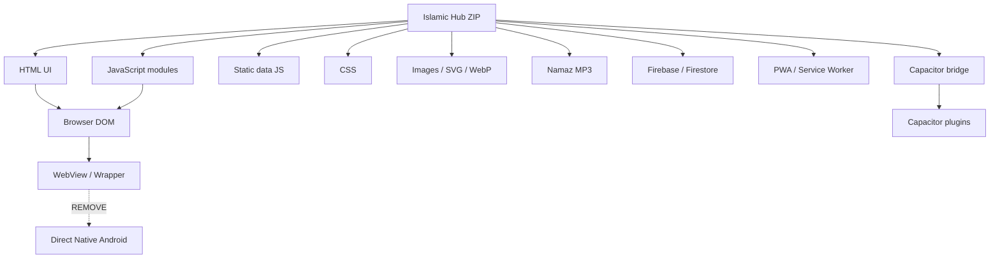
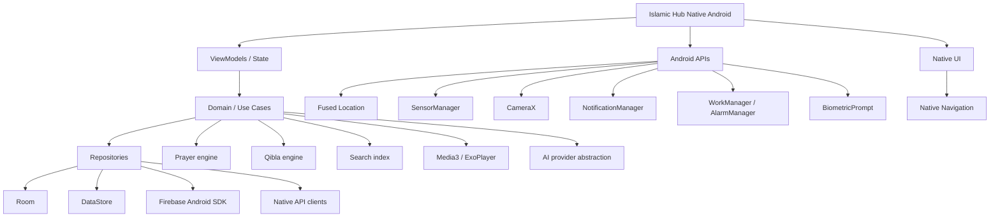
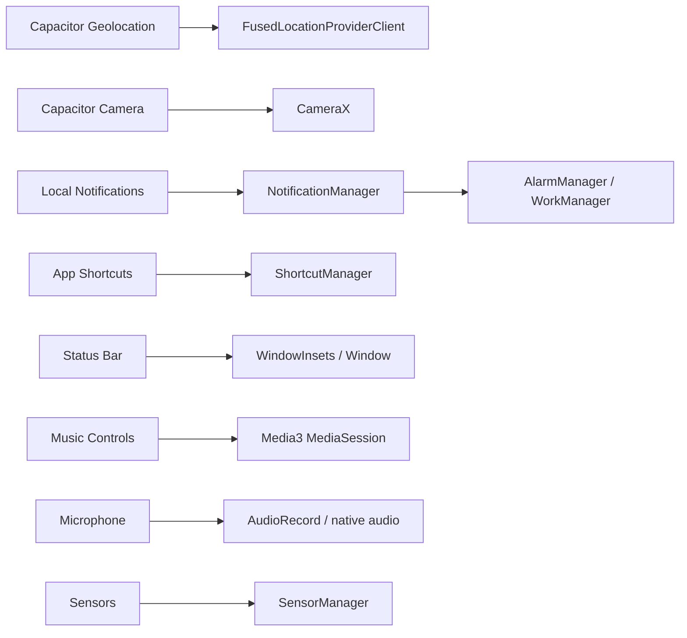
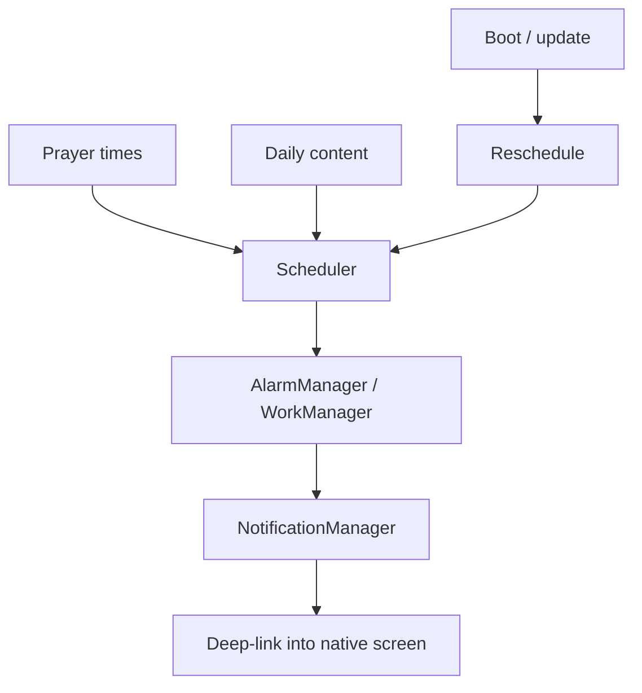
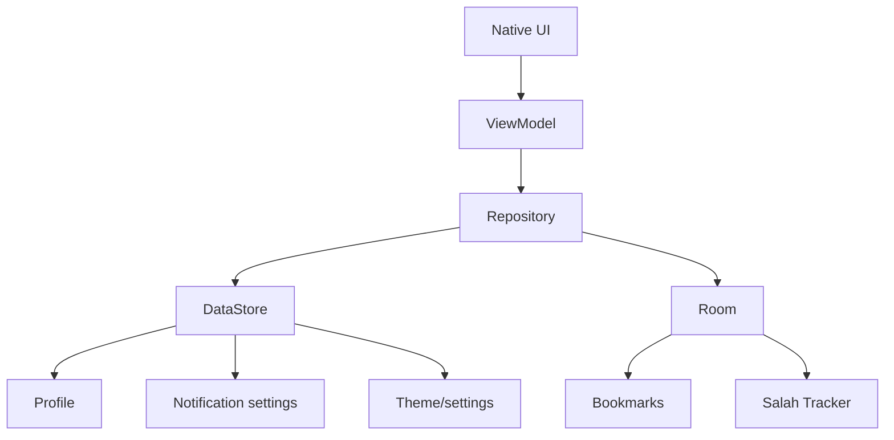
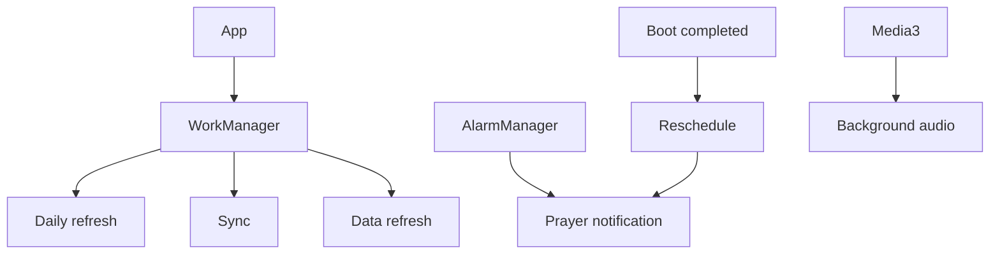
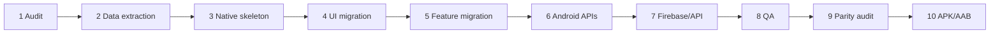

# Islamic Hub — Direct Native Android Conversion Master Plan

**Goal:** এই project-কে কোনো WebView/Capacitor/Cordova/HTML-wrapper দিয়ে Android app হিসেবে চালানো নয়; existing feature, UI, data, assets, audio, logic এবং user-facing behavior **direct native Android source code**-এ পুনর্নির্মাণ করা।

**Target stack:** Kotlin + Android SDK + Jetpack + Material components + XML/View-based UI যেখানে existing UI-র fidelity বেশি জরুরি। Browser/Capacitor capability-এর বদলে সরাসরি Android API ব্যবহার হবে।

**Full-version rule:** বর্তমান source-এর কোনো user-visible feature, screen, data set, asset, audio, setting, search behavior, bookmark, tracker, notification, permission flow, scanner, compass, prayer-time behavior বা admin functionality ইচ্ছাকৃতভাবে বাদ যাবে না।

---

## 1. Current source audit

Uploaded archive: `islamic-hub-source.zip`

- Total archive files: **127**
- JavaScript files: **40**
- HTML files: **4**
- CSS files: **1**
- JSON/config files: **6**
- Image/vector assets: **59**
- Namaz audio assets: **15**

### Current architecture



### Target architecture



---

## 2. What must be removed from final runtime

These must not be required by the final APK/AAB:

- Capacitor WebView/container
- `window.Capacitor`
- `@capacitor/*` runtime imports
- HTML pages as the application UI
- CSS as the primary UI layer
- browser `localStorage`
- browser notification API
- browser geolocation/camera fallbacks
- browser sensor APIs
- PWA `manifest.json` as the app shell
- `sw.js` as the application runtime
- `capacitor.config.json` as a runtime dependency
- `capacitor-plugins.js`
- DOM-generated screens/modals as the final UI
- Node/npm/browser runtime

The original files may remain in a migration/reference folder, but the native application must build and run independently.

---

## 3. Native replacement table

| Existing | Direct native replacement |
|---|---|
| HTML pages | Android Activities/Fragments + Navigation |
| CSS | XML layouts + Material components + drawables + themes |
| JavaScript modules | Kotlin classes/services/repositories/use-cases |
| `localStorage` | DataStore + Room |
| Firebase web SDK | Firebase Android SDK |
| Capacitor Geolocation | FusedLocationProviderClient |
| Capacitor Camera | CameraX |
| Local Notifications | NotificationManager + AlarmManager/WorkManager |
| App Settings | Android Settings Intent |
| App Shortcuts | ShortcutManager |
| StatusBar plugin | WindowInsets/window APIs |
| Music Controls | Media3 MediaSession |
| Browser microphone | RECORD_AUDIO + native audio APIs |
| Browser sensors | SensorManager |
| Web Share | Android Sharesheet |
| `` / CSS background | Android drawable resources + Coil |
| Web audio | Media3/ExoPlayer |
| JS globals | Typed Kotlin state/repositories |
| `fetch()` | Retrofit/OkHttp or native HTTP abstraction |

---

## 4. Full feature parity map

- **Main Islamic Hub / home** → `islamic.html`, `index.html`, `floating-nav.css`
- **Quran** → `quran.html`, `quran-module.js`, `quran_banner.webp`
- **Hadith** → `hadith-data.js`, `hadith-api.js`, `extended-hadith-data.js`
- **Namaz / Salah** → `namazshikkha-data.js`, `namaz-data.js`, `extended-namaz-data.js`, `namaz-extras-data.js`
- **Prayer times / location** → `prayer-times.js`, `location-data.js`
- **Qibla** → `qibla-compass.js`
- **Dua** → `dua-data.js`
- **Zikr / Tasbih** → `zikr-counter.js`
- **Asmaul Husna** → `asmaul-husna-data.js`
- **Stories / Prophets / Khalifas** → `islamic-stories-data.js`
- **Misconceptions** → `misconceptions-module.js`, `misconceptions-data.js`
- **Questions & Answers** → `question-data.js`, `ans-data.js`
- **Tajweed / voice** → `tajbeed-checker.js`
- **Vision scanner** → `vision-scanner.js`
- **AI Scholar** → `ai-scholar.js`, `ai-scholar-original.js`, `ai-modal.js`, `secrets.js`
- **Search** → `search-service.js`
- **Bookmarks** → `bookmark-service.js`
- **Profile / custom Jamaat** → `profile-service.js`
- **Salah tracker / streaks** → `salah-tracker.js`, `trackers.js`
- **Daily content** → `daily-content.js`
- **Notifications** → `notification-service.js`
- **Sync / Firebase** → `sync-service.js`, `firebase.json`, `firestore.rules`, `database.rules.json`, `firestore.indexes.json`
- **Analytics** → `analytics-service.js`
- **App lock** → `app-lock.js`
- **Permissions** → `permission-service.js`
- **Performance** → `performance-engine.js`
- **PWA / wrapper references** → `manifest.json`, `sw.js`, `capacitor.config.json`, `capacitor-plugins.js`
- **Admin** → `admin.html`

---

## 5. Native project structure

```text
app/
├── src/main/
│   ├── AndroidManifest.xml
│   ├── java/com/islamichub/
│   │   ├── MainActivity.kt
│   │   ├── IslamicHubApplication.kt
│   │   ├── core/
│   │   │   ├── navigation/
│   │   │   ├── ui/
│   │   │   ├── theme/
│   │   │   ├── localization/
│   │   │   ├── permissions/
│   │   │   └── utils/
│   │   ├── data/
│   │   │   ├── local/db/
│   │   │   ├── local/dao/
│   │   │   ├── local/entities/
│   │   │   ├── preferences/
│   │   │   ├── firebase/
│   │   │   ├── api/
│   │   │   └── repository/
│   │   ├── feature/
│   │   │   ├── home/
│   │   │   ├── quran/
│   │   │   ├── hadith/
│   │   │   ├── namaz/
│   │   │   ├── prayer/
│   │   │   ├── qibla/
│   │   │   ├── dua/
│   │   │   ├── zikr/
│   │   │   ├── asmaulhusna/
│   │   │   ├── stories/
│   │   │   ├── misconceptions/
│   │   │   ├── questions/
│   │   │   ├── tajweed/
│   │   │   ├── scanner/
│   │   │   ├── ai/
│   │   │   ├── search/
│   │   │   ├── bookmarks/
│   │   │   ├── profile/
│   │   │   ├── tracker/
│   │   │   └── admin/
│   │   └── services/
│   │       ├── PrayerNotificationWorker.kt
│   │       ├── DailyContentWorker.kt
│   │       └── SyncWorker.kt
│   └── res/
│       ├── layout/
│       ├── drawable/
│       ├── drawable-nodpi/
│       ├── mipmap/
│       ├── font/
│       ├── raw/
│       ├── values/
│       ├── values-bn/
│       ├── xml/
│       └── navigation/
└── build.gradle.kts
```

---

## 6. Screens that must be recreated

At minimum:

1. Main Islamic Hub/home
2. Quran
3. Hadith
4. Namaz / Salah learning
5. Prayer times
6. Qibla compass
7. Dua
8. Zikr/Tasbih
9. Asmaul Husna
10. Islamic stories
11. Prophets
12. Khalifas
13. Misconceptions
14. Questions & Answers
15. Tajweed checker
16. Vision/photo scanner
17. AI Scholar
18. Search
19. Bookmarks
20. Profile/settings
21. Salah tracker
22. Daily content/inspiration
23. Notifications/reminders
24. App lock
25. Admin panel
26. Every current dialog, drawer, popup, bottom sheet and dynamically-generated view

**Important:** `qibla-compass.js` dynamically creates a modal; that is still a real screen/feature and must become a native destination/dialog.

---

## 7. Data migration — zero intentional data loss

The large JS data files must be converted programmatically, not manually retyped.

Required native data categories:

```text
Quran
Hadith
Extended Hadith
Dua
Namaz
Extended Namaz
Namaz Shikkha
Namaz extras
Asmaul Husna
Islamic Stories
Prophets
Khalifas
Questions
Answers
Misconceptions
Location data
Daily content
```

Recommended strategy:

```text
Existing JS data
      ↓
Deterministic extraction script
      ↓
JSON / Kotlin models
      ↓
Validation + record counts + checksums
      ↓
Android bundled assets / Room seed
```

Every source record should have a migration validation report.

---

## 8. Assets — no visual asset should be forgotten

### Root media

- `islamichub/favicon.png`
- `islamichub/icon-192.png`
- `islamichub/icon-512.png`
- `islamichub/islamic_banner.webp`
- `islamichub/islamic_premium_bg.webp`
- `islamichub/logo.png`
- `islamichub/quran_banner.webp`

### `img/`

- `islamichub/img/asmaul_husna_light_bg.webp`
- `islamichub/img/card-dua.webp`
- `islamichub/img/card-prayer.webp`
- `islamichub/img/card-tasbih.webp`
- `islamichub/img/dua-premium-bg.webp`
- `islamichub/img/hadith-premium-bg.webp`
- `islamichub/img/hero-hadith-premium.webp`
- `islamichub/img/hero-hadith.webp`
- `islamichub/img/hero-hub.webp`
- `islamichub/img/hero-masjid.webp`
- `islamichub/img/hero-premium-day.webp`
- `islamichub/img/hero-premium-masjid.webp`
- `islamichub/img/hero-quran.webp`
- `islamichub/img/hero-topics-premium.webp`
- `islamichub/img/hero-topics.webp`
- `islamichub/img/ht.hlml`
- `islamichub/img/inspiration-bg.webp`
- `islamichub/img/khalifas-premium-bg.webp`
- `islamichub/img/namaz-asr-bg.webp`
- `islamichub/img/namaz-dhuhr-bg.webp`
- `islamichub/img/namaz-fajr-bg.webp`
- `islamichub/img/namaz-isha-bg.webp`
- `islamichub/img/namaz-maghrib-bg.webp`
- `islamichub/img/namaz-premium-bg.webp`
- `islamichub/img/namaz-shikkha-bg.webp`
- `islamichub/img/prayer-premium-bg.webp`
- `islamichub/img/premium-mosque.svg`
- `islamichub/img/premium-quran-bg.webp`
- `islamichub/img/profile-premium-bg.webp`
- `islamichub/img/prophets-premium-bg.webp`
- `islamichub/img/qibla-premium-bg.webp`
- `islamichub/img/quran-pattern-1.webp`
- `islamichub/img/quran-pattern-2.webp`
- `islamichub/img/quran-pattern-3.webp`
- `islamichub/img/quran-premium-bg.webp`
- `islamichub/img/salah-premium-bg.webp`
- `islamichub/img/sidebar-header-bg.webp`
- `islamichub/img/sidebar-premium-bg.webp`
- `islamichub/img/stories-premium-bg.webp`
- `islamichub/img/streak-bg-1.webp`
- `islamichub/img/streak-bg-2.webp`
- `islamichub/img/streak-bg-3.webp`
- `islamichub/img/streak-bg-4.webp`
- `islamichub/img/streak-bg-5.webp`
- `islamichub/img/surah-pattern-1.webp`
- `islamichub/img/surah-pattern-2.webp`
- `islamichub/img/surah-pattern-3.webp`
- `islamichub/img/tajweed-premium-bg.webp`
- `islamichub/img/tasbih-bg.webp`
- `islamichub/img/topics-premium-bg.webp`
- `islamichub/img/voice-ai-bg.webp`
- `islamichub/img/zikr-premium-bg.webp`

### Namaz audio

- `islamichub/namaz-audio/azan2.mp3`
- `islamichub/namaz-audio/dua-al-istiftah.mp3`
- `islamichub/namaz-audio/fatiha.mp3`
- `islamichub/namaz-audio/ikhlas.mp3`
- `islamichub/namaz-audio/jalsah.mp3`
- `islamichub/namaz-audio/qawamah.mp3`
- `islamichub/namaz-audio/qunut.mp3`
- `islamichub/namaz-audio/ruku.mp3`
- `islamichub/namaz-audio/sajdah.mp3`
- `islamichub/namaz-audio/salam.mp3`
- `islamichub/namaz-audio/salat-alan-nabi-darud.mp3`
- `islamichub/namaz-audio/taawwuz.mp3`
- `islamichub/namaz-audio/takbir-tahrimah.mp3`
- `islamichub/namaz-audio/tashahud.mp3`
- `islamichub/namaz-audio/tasmiah.mp3`

Recommended destinations:

```text
images/SVG/WebP/PNG → res/drawable or drawable-nodpi
MP3 → res/raw
icons → res/drawable / mipmap
```

Do not delete a visual asset merely because it was originally referenced by CSS.

---

## 9. Capacitor/native bridge conversion

Detected plugin references:

- `@capacitor/app`
- `@capacitor/camera`
- `@capacitor/geolocation`
- `@capacitor/haptics`
- `@capacitor/keyboard`
- `@capacitor/local-notifications`
- `@capacitor/permissions`
- `@capacitor/preferences`
- `@capacitor/push-notifications`
- `@capacitor/share`
- `@capacitor/splash-screen`
- `@capacitor/status-bar`
- `@capawesome/capacitor-app-shortcuts`

Native mapping:



---

## 10. Prayer times

Native module must preserve:

- automatic location
- manual location
- Bangladesh division/district/upazila data
- prayer calculations
- Fajr
- Dhuhr
- Asr
- Maghrib
- Isha
- custom Jamaat time override
- profile integration
- prayer reminders
- date handling
- existing display behavior

Classes:

```text
PrayerTimeRepository
PrayerCalculationEngine
LocationRepository
PrayerTimeViewModel
PrayerNotificationScheduler
CustomJamaatRepository
```

---

## 11. Qibla compass

The current source uses Mecca:

```text
Latitude  = 21.422487
Longitude = 39.826206
```

Native flow:

```text
Fused Location
      +
Accelerometer
      +
Magnetic Field Sensor
      ↓
Rotation/orientation calculation
      ↓
Qibla bearing
      ↓
Native compass UI
```

Preserve:

- degree display
- compass ring
- North indicator
- location status
- retry
- permission explanation
- theme/background
- live orientation

---

## 12. Notifications



Must support:

- Android 13+ notification permission
- prayer notifications
- daily notifications
- enable/disable
- rescheduling
- custom Jamaat times
- stable notification IDs
- notification tap navigation

---

## 13. Audio / Quran player

Use AndroidX Media3/ExoPlayer + MediaSession.

Preserve:

- play/pause
- seek
- Surah navigation
- playlist behavior
- lifecycle
- audio focus
- background playback where current behavior needs it
- media notification controls

### Known missing source audio references

The existing worklog identifies references to:

- `sana.mp3`
- `takbir.mp3`
- `durood.mp3`
- `janaza_dua_adult.mp3`
- `istikhara_dua.mp3`
- `tarabih_dua.mp3`

These must be explicitly mapped to a semantically correct existing asset or supplied as missing source assets. **Do not silently remove those features.**

---

## 14. Search

Native search must cover:

```text
Quran
Hadith
Extended Hadith
Dua
Namaz
Stories
Prophets
Khalifas
Questions
Answers
Misconceptions
Asmaul Husna
Daily content
```

Existing source bugs identified during audit must be corrected in the native implementation rather than copied.

Known issues include:

- Kalima search checks the wrong data shape.
- Extended Hadith search expects `items` instead of `hadiths`.
- Stories search assumes prophets/khalifas are objects rather than arrays.
- `meraj` is omitted from the story search categories.
- Q&A search refers to `QUESTION_DATA` while source globals use `questionData`/`ansData`.
- Misconceptions search expects wrong top-level and item fields.
- Asmaul Husna search expects `bangla` although data uses `transliteration`.

---

## 15. Data-quality corrections to perform during migration

The existing worklog identified:

### Namaz Shikkha

- Surah Fatiha `content.arabic` contains Bengali transliteration in the latter part.
- Arabic dua contains `নাফْسِي` instead of `نَفْسِي`.

These should be corrected with a migration change log.

### Global collision

Both `namaz-data.js` and `namazshikkha-data.js` define `window.namazData` with different shapes.

Native Kotlin models must separate these structures completely.

---

## 16. Profile, bookmarks, tracker and settings



Retain all existing persisted behavior including:

- bookmarks
- prayer notification settings
- daily notification setting
- profile settings
- custom Jamaat times
- streak/tracker state
- app lock state
- theme
- relevant search/history state

---

## 17. App lock

Use:

- `BiometricPrompt`
- secure local state
- Android lifecycle lock
- PIN fallback only where the current feature requires it

Never store sensitive lock secrets in plaintext.

---

## 18. Vision scanner

Native flow:

```text
CameraX Preview
      ↓
Image Capture / Analysis
      ↓
Current recognition/AI pipeline
      ↓
Result
      ↓
Native result UI
```

Preserve camera permission, processing state, result state, retry and errors.

---

## 19. Tajweed / microphone

Native implementation:

- `RECORD_AUDIO`
- native audio capture
- current analysis/AI backend
- current progress/result/error behavior
- no browser `getUserMedia()` dependency

---

## 20. AI Scholar

Use a provider abstraction:

```kotlin
interface AiScholarRepository {
    suspend fun ask(
        question: String,
        context: String? = null
    ): Result<AiAnswer>
}
```

**Security:** private API keys must never be hardcoded into the APK. If a backend secret is required, keep it server-side.

---

## 21. Firebase / sync

Relevant files include:

- `islamichub/database.rules.json`
- `islamichub/firestore.indexes.json`
- `islamichub/firestore.rules`
- `islamichub/firebase.json`

Native target:

```text
Firebase Android SDK
Firestore
Authentication if currently used
Storage if currently used
Analytics if currently used
FCM only if actual push notification functionality requires it
```

Migrate rules/indexes carefully. Do not blindly copy web secrets into Kotlin.

---

## 22. Admin panel

`admin.html` must not be forgotten.

Its functionality must be inventoried and migrated either into:

```text
Native AdminActivity/Admin navigation
```

or, if it is intentionally an operator-only interface:

```text
Separate secure admin client/backend
```

But the existing admin capabilities must remain available.

---

## 23. UI conversion rules

### Preserve

- colors
- typography hierarchy
- Bengali typography
- Arabic/RTL rendering
- cards
- banners
- premium backgrounds
- icons
- spacing
- corner radius
- drawers
- tabs
- dialogs
- bottom sheets
- loading/empty/error states
- dark/light theme
- important animations

### Rebuild as reusable native components

```text
IslamicTopBar
PremiumCard
SectionHeader
HeroBanner
FeatureCard
PrayerCard
QuranAyahRow
HadithCard
DuaCard
StoryCard
SearchResultCard
BottomNavigation
SideDrawer
NativeDialog
LoadingView
EmptyStateView
ErrorStateView
```

Do not mechanically translate every CSS rule. First derive the UI system, then implement reusable native components.

---

## 24. Android permissions

Review only the permissions actually required:

```xml
ACCESS_FINE_LOCATION
ACCESS_COARSE_LOCATION
CAMERA
POST_NOTIFICATIONS
RECORD_AUDIO
INTERNET
VIBRATE
WAKE_LOCK
RECEIVE_BOOT_COMPLETED
FOREGROUND_SERVICE
FOREGROUND_SERVICE_MEDIA_PLAYBACK
```

Each runtime permission needs:

1. request
2. rationale
3. denied state
4. permanently denied/settings state
5. graceful fallback

---

## 25. Background execution



Do not create unnecessary persistent services.

---

## 26. Testing / parity gate

### Functional

- [ ] Every screen opens
- [ ] Every navigation route works
- [ ] Quran works
- [ ] Hadith works
- [ ] Namaz works
- [ ] Dua works
- [ ] Prayer times work
- [ ] Qibla works
- [ ] Zikr works
- [ ] Bookmarks persist
- [ ] Search covers all categories
- [ ] Stories work
- [ ] Misconceptions work
- [ ] Q&A works
- [ ] Tajweed works
- [ ] Scanner works
- [ ] AI works
- [ ] Profile persists
- [ ] Salah tracker persists
- [ ] Notifications work
- [ ] App lock works
- [ ] Admin works

### Device/UI

- [ ] Android 8/9 target if required
- [ ] Android 10+
- [ ] Android 12+
- [ ] Android 13+ notification permission
- [ ] Android 14+
- [ ] Android 15+
- [ ] Android 16 where supported
- [ ] small screens
- [ ] large screens
- [ ] portrait
- [ ] rotation behavior
- [ ] dark mode
- [ ] Bengali
- [ ] Arabic/RTL
- [ ] offline behavior
- [ ] low-memory behavior

---

## 27. Migration phases



### Phase 1 — Audit
Freeze the uploaded source as the baseline and produce file/feature/asset/data/API inventories.

### Phase 2 — Data extraction
Programmatically transform JS data into validated native data.

### Phase 3 — Native skeleton
Create Gradle project, Application, MainActivity, navigation, theme, Room, DataStore, repositories and permission manager.

### Phase 4 — UI
Recreate every screen and reusable component natively.

### Phase 5 — Features
Port every JS service.

### Phase 6 — Native APIs
Replace browser/Capacitor capabilities with Android APIs.

### Phase 7 — Backend
Migrate Firebase/API integrations securely.

### Phase 8 — QA
Run functional, UI and device tests.

### Phase 9 — Parity gate
No feature is complete until its native equivalent is verified.

### Phase 10 — Release
Generate debug APK, release APK and AAB with proper signing/release configuration.

---

## 28. Definition of “full version”

The conversion is complete only when:

```text
Current feature set == Native feature set
Current user-visible assets ⊆ Native resources
Current persistent state → Native persistence
Current device features → Native Android APIs
Final UI → Native Android UI
Final runtime → No WebView/HTML/Capacitor dependency
```

---

## 29. Complete archive inventory

### All files

- `islamichub/admin.html`
- `islamichub/ai-modal.js`
- `islamichub/ai-scholar-original.js`
- `islamichub/ai-scholar.js`
- `islamichub/analytics-service.js`
- `islamichub/ans-data.js`
- `islamichub/app-lock.js`
- `islamichub/asmaul-husna-data.js`
- `islamichub/bookmark-service.js`
- `islamichub/capacitor-plugins.js`
- `islamichub/capacitor.config.json`
- `islamichub/daily-content.js`
- `islamichub/database.rules.json`
- `islamichub/dua-data.js`
- `islamichub/extended-hadith-data.js`
- `islamichub/extended-namaz-data.js`
- `islamichub/favicon.png`
- `islamichub/firebase.json`
- `islamichub/firestore.indexes.json`
- `islamichub/firestore.rules`
- `islamichub/floating-nav.css`
- `islamichub/google-services.json`
- `islamichub/hadith-api.js`
- `islamichub/hadith-data.js`
- `islamichub/icon-192.png`
- `islamichub/icon-512.png`
- `islamichub/img/asmaul_husna_light_bg.webp`
- `islamichub/img/card-dua.webp`
- `islamichub/img/card-prayer.webp`
- `islamichub/img/card-tasbih.webp`
- `islamichub/img/dua-premium-bg.webp`
- `islamichub/img/hadith-premium-bg.webp`
- `islamichub/img/hero-hadith-premium.webp`
- `islamichub/img/hero-hadith.webp`
- `islamichub/img/hero-hub.webp`
- `islamichub/img/hero-masjid.webp`
- `islamichub/img/hero-premium-day.webp`
- `islamichub/img/hero-premium-masjid.webp`
- `islamichub/img/hero-quran.webp`
- `islamichub/img/hero-topics-premium.webp`
- `islamichub/img/hero-topics.webp`
- `islamichub/img/ht.hlml`
- `islamichub/img/inspiration-bg.webp`
- `islamichub/img/khalifas-premium-bg.webp`
- `islamichub/img/namaz-asr-bg.webp`
- `islamichub/img/namaz-dhuhr-bg.webp`
- `islamichub/img/namaz-fajr-bg.webp`
- `islamichub/img/namaz-isha-bg.webp`
- `islamichub/img/namaz-maghrib-bg.webp`
- `islamichub/img/namaz-premium-bg.webp`
- `islamichub/img/namaz-shikkha-bg.webp`
- `islamichub/img/prayer-premium-bg.webp`
- `islamichub/img/premium-mosque.svg`
- `islamichub/img/premium-quran-bg.webp`
- `islamichub/img/profile-premium-bg.webp`
- `islamichub/img/prophets-premium-bg.webp`
- `islamichub/img/qibla-premium-bg.webp`
- `islamichub/img/quran-pattern-1.webp`
- `islamichub/img/quran-pattern-2.webp`
- `islamichub/img/quran-pattern-3.webp`
- `islamichub/img/quran-premium-bg.webp`
- `islamichub/img/salah-premium-bg.webp`
- `islamichub/img/sidebar-header-bg.webp`
- `islamichub/img/sidebar-premium-bg.webp`
- `islamichub/img/stories-premium-bg.webp`
- `islamichub/img/streak-bg-1.webp`
- `islamichub/img/streak-bg-2.webp`
- `islamichub/img/streak-bg-3.webp`
- `islamichub/img/streak-bg-4.webp`
- `islamichub/img/streak-bg-5.webp`
- `islamichub/img/surah-pattern-1.webp`
- `islamichub/img/surah-pattern-2.webp`
- `islamichub/img/surah-pattern-3.webp`
- `islamichub/img/tajweed-premium-bg.webp`
- `islamichub/img/tasbih-bg.webp`
- `islamichub/img/topics-premium-bg.webp`
- `islamichub/img/voice-ai-bg.webp`
- `islamichub/img/zikr-premium-bg.webp`
- `islamichub/index.html`
- `islamichub/islamic-stories-data.js`
- `islamichub/islamic.html`
- `islamichub/islamic_banner.webp`
- `islamichub/islamic_premium_bg.webp`
- `islamichub/kalima-data.js`
- `islamichub/location-data.js`
- `islamichub/logo.png`
- `islamichub/manifest.json`
- `islamichub/misconceptions-data.js`
- `islamichub/misconceptions-module.js`
- `islamichub/namaz-audio/azan2.mp3`
- `islamichub/namaz-audio/dua-al-istiftah.mp3`
- `islamichub/namaz-audio/fatiha.mp3`
- `islamichub/namaz-audio/ikhlas.mp3`
- `islamichub/namaz-audio/jalsah.mp3`
- `islamichub/namaz-audio/qawamah.mp3`
- `islamichub/namaz-audio/qunut.mp3`
- `islamichub/namaz-audio/ruku.mp3`
- `islamichub/namaz-audio/sajdah.mp3`
- `islamichub/namaz-audio/salam.mp3`
- `islamichub/namaz-audio/salat-alan-nabi-darud.mp3`
- `islamichub/namaz-audio/taawwuz.mp3`
- `islamichub/namaz-audio/takbir-tahrimah.mp3`
- `islamichub/namaz-audio/tashahud.mp3`
- `islamichub/namaz-audio/tasmiah.mp3`
- `islamichub/namaz-data.js`
- `islamichub/namaz-extras-data.js`
- `islamichub/namazshikkha-data.js`
- `islamichub/notification-service.js`
- `islamichub/performance-engine.js`
- `islamichub/permission-service.js`
- `islamichub/prayer-times.js`
- `islamichub/profile-service.js`
- `islamichub/qibla-compass.js`
- `islamichub/question-data.js`
- `islamichub/quran-module.js`
- `islamichub/quran.html`
- `islamichub/quran_banner.webp`
- `islamichub/salah-tracker.js`
- `islamichub/search-service.js`
- `islamichub/secrets.js`
- `islamichub/sw.js`
- `islamichub/sync-service.js`
- `islamichub/tajbeed-checker.js`
- `islamichub/trackers.js`
- `islamichub/vision-scanner.js`
- `islamichub/zikr-counter.js`
- `worklog.md`

### JavaScript

- `islamichub/ai-modal.js`
- `islamichub/ai-scholar-original.js`
- `islamichub/ai-scholar.js`
- `islamichub/analytics-service.js`
- `islamichub/ans-data.js`
- `islamichub/app-lock.js`
- `islamichub/asmaul-husna-data.js`
- `islamichub/bookmark-service.js`
- `islamichub/capacitor-plugins.js`
- `islamichub/daily-content.js`
- `islamichub/dua-data.js`
- `islamichub/extended-hadith-data.js`
- `islamichub/extended-namaz-data.js`
- `islamichub/hadith-api.js`
- `islamichub/hadith-data.js`
- `islamichub/islamic-stories-data.js`
- `islamichub/kalima-data.js`
- `islamichub/location-data.js`
- `islamichub/misconceptions-data.js`
- `islamichub/misconceptions-module.js`
- `islamichub/namaz-data.js`
- `islamichub/namaz-extras-data.js`
- `islamichub/namazshikkha-data.js`
- `islamichub/notification-service.js`
- `islamichub/performance-engine.js`
- `islamichub/permission-service.js`
- `islamichub/prayer-times.js`
- `islamichub/profile-service.js`
- `islamichub/qibla-compass.js`
- `islamichub/question-data.js`
- `islamichub/quran-module.js`
- `islamichub/salah-tracker.js`
- `islamichub/search-service.js`
- `islamichub/secrets.js`
- `islamichub/sw.js`
- `islamichub/sync-service.js`
- `islamichub/tajbeed-checker.js`
- `islamichub/trackers.js`
- `islamichub/vision-scanner.js`
- `islamichub/zikr-counter.js`

### HTML

- `islamichub/admin.html`
- `islamichub/index.html`
- `islamichub/islamic.html`
- `islamichub/quran.html`

### CSS

- `islamichub/floating-nav.css`

### JSON/config

- `islamichub/capacitor.config.json`
- `islamichub/database.rules.json`
- `islamichub/firebase.json`
- `islamichub/firestore.indexes.json`
- `islamichub/google-services.json`
- `islamichub/manifest.json`

---

## 30. Final implementation contract

**কোনো wrapper নয়। কোনো WebView নয়। কোনো HTML-as-UI নয়। কোনো Capacitor dependency নয়।**

Final application must be:

```text
Kotlin
+
Android SDK
+
Native Android UI
+
Native Android services
+
Room/DataStore
+
Native Firebase/API integration
+
All current data
+
All current assets
+
All current user-facing features
+
Feature parity
+
Behavior parity
+
UI parity
```

এই MD-টি implementation-এর baseline/spec হিসেবে ব্যবহার করতে হবে। পরবর্তী কাজ হবে **source-first → data parity → UI parity → native API parity → full testing → APK/AAB**।
