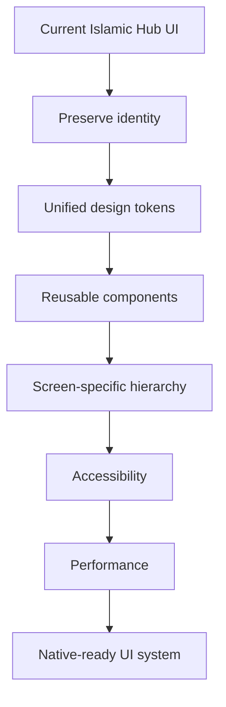
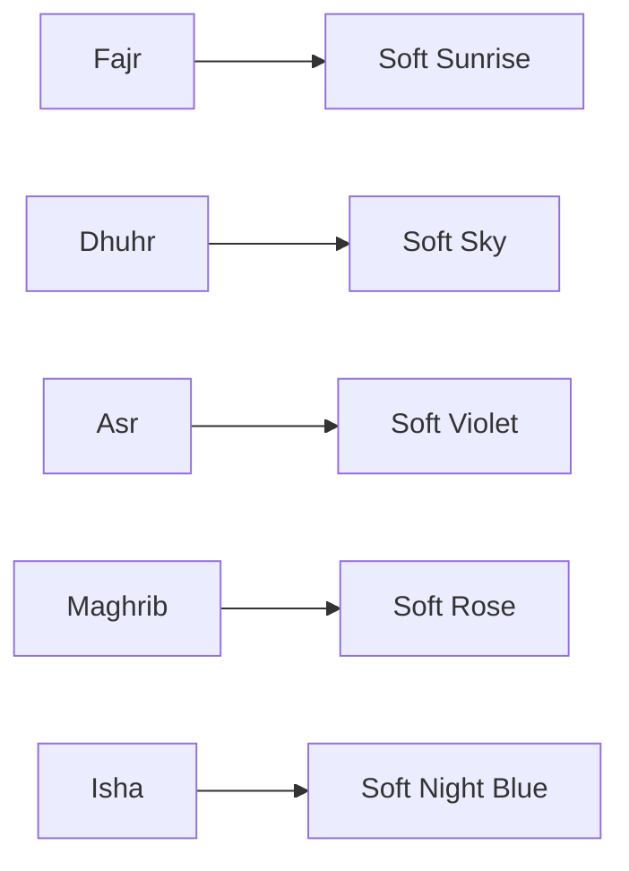
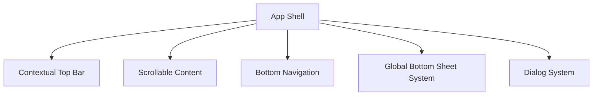
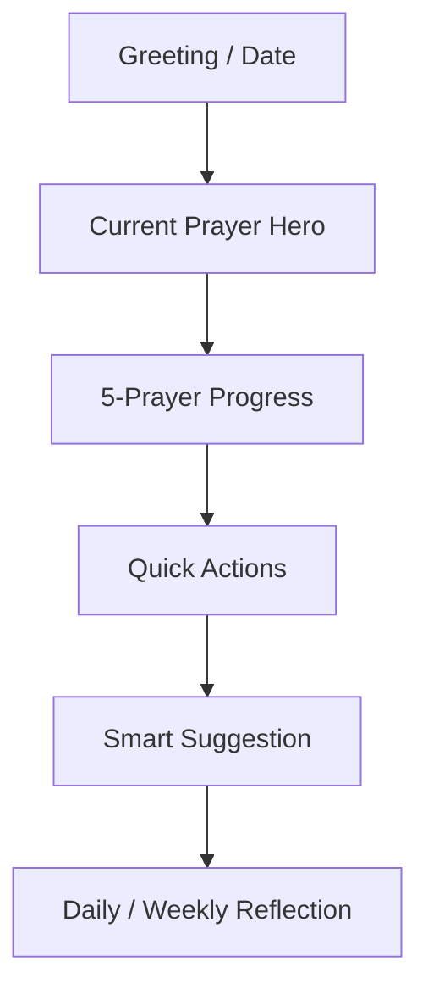
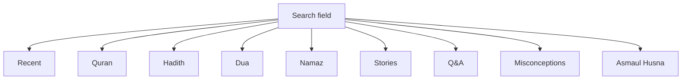
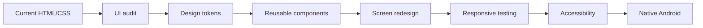

# Islamic Hub — UI/UX Upgrade Master Plan

## 0. Objective

এই plan-এর লক্ষ্য current Islamic Hub-এর existing UI/UX **ভেঙে নতুন app বানানো নয়**; বরং current visual identity, features, content, assets এবং navigation রেখে এটাকে:

- আরও premium
- আরও consistent
- আরও readable
- আরও mobile-friendly
- আরও accessible
- আরও দ্রুত
- আরও polished
- direct-native Android conversion-এর জন্য design-system-ready

করা।

**Primary design direction:** বর্তমান screenshot-এর **soft Islamic premium / lavender-violet + warm ivory + muted gold** visual language রাখা হবে। Completely different theme করা হবে না।

---

# 1. Current project baseline

Uploaded source inventory:

- Files: **127**
- HTML: **4**
- CSS: **1**
- JavaScript: **40**

Current CSS-এর সবচেয়ে বেশি ব্যবহৃত color tokens:

```text
#020617  × 1
```

এই existing colors audit করে final design tokens তৈরি করতে হবে; arbitrary নতুন color screen-by-screen যোগ করা যাবে না।

---

# 2. Current screenshot assessment

Current screenshot-এর design direction ভালো এবং preserve করা উচিত।

### Strong points

- Soft Islamic visual identity
- Purple/lavender primary accent
- Warm white background
- Pastel prayer-specific accents
- Large hero card
- Clear bottom navigation
- Prayer progress concept
- Qada tracker
- Islamic illustrations
- Good emotional/wellness feel

### Main UX problems to solve

1. বিভিন্ন screen-এ visual hierarchy পুরোপুরি unified নয়।
2. কিছু card-এ information density বেশি।
3. active navigation state-এ icon + color + dot + bold text একসাথে বেশি visual signal দেয়।
4. prayer colors semantic হলেও tokenized system দরকার।
5. card radius/spacing/shadow এক design system-এর অধীনে আনতে হবে।
6. hero illustrations-এর সাথে text contrast আরও controlled হওয়া দরকার।
7. touch targets আরও consistent করতে হবে।
8. typography hierarchy আরও পরিষ্কার করতে হবে।
9. Home screen-এ vertical information overload কমাতে হবে।
10. Arabic/Bengali/English typography আলাদাভাবে optimize করতে হবে।
11. dark mode-এর জন্য proper token system দরকার।
12. loading/empty/error/offline/permission states-এর visual system এক করা দরকার।

---

# 3. New design philosophy



### Design principle

**Calm → Clear → Spiritual → Premium → Fast**

UI যেন flashy Islamic template-এর মতো না হয়ে modern wellness/productivity app-এর মতো feel দেয়।

---

# 4. Color system

## Primary palette

Recommended baseline:

| Token | Value | Usage |
|---|---|---|
| `primary` | `#6D45C7` | Primary action/active state |
| `primaryDark` | `#4F3295` | Pressed/strong emphasis |
| `primarySoft` | `#F1EBFA` | Selected cards/background |
| `background` | `#FCFAF7` | Main app background |
| `surface` | `#FFFFFF` | Cards/sheets |
| `surfaceAlt` | `#F7F4F8` | Secondary surfaces |
| `textPrimary` | `#24212B` | Main text |
| `textSecondary` | `#77727D` | Supporting text |
| `divider` | `#ECE8EF` | Dividers |
| `gold` | `#C9A34E` | Spiritual/premium accent |
| `goldSoft` | `#F7E8B5` | Gold background |

**Important:** final implementation should compare these against the existing source tokens before replacing them. Existing colors that already match can remain.

---

# 5. Prayer semantic color system

Prayer-specific colors থাকবে, কিন্তু পুরো card-এর background saturated হবে না।



Recommended approach:

```text
Prayer icon
    ↓
soft tinted circular background
    ↓
neutral card
    ↓
small semantic accent
```

এতে পুরো app rainbow-like হয়ে যাবে না।

---

# 6. Design tokens

সব screen-এর জন্য centralized tokens তৈরি করতে হবে।

```text
Colors
Typography
Spacing
Radius
Elevation
Icon size
Touch target
Motion
Opacity
Divider
Card padding
Screen padding
```

### Spacing scale

```text
4dp
8dp
12dp
16dp
20dp
24dp
32dp
40dp
48dp
```

Arbitrary `13px`, `17px`, `23px` style values কমাতে হবে।

### Radius

```text
small       12dp
card        16dp
hero        20dp
sheet       24dp
pill        999dp
```

---

# 7. Typography system

## English/Bengali

```text
Display       30–32sp
H1            24sp
H2            20sp
H3            17–18sp
Body          15–16sp
Body Small    14sp
Caption       12–13sp
```

## Arabic

Arabic text-এর জন্য আলাদা typography token:

```text
ArabicLarge
ArabicBody
ArabicAyah
ArabicDua
ArabicHadith
```

### Rules

- Arabic-এর line height বেশি হবে।
- Bengali + Arabic mixed line-এ clipping হবে না।
- Arabic diacritics কখনো crop করা যাবে না।
- RTL content-এর direction explicit হবে।
- Text justification সতর্কভাবে ব্যবহার করতে হবে।

---

# 8. Global app shell



### Screen structure

```text
┌─────────────────────────┐
│ Context / Top Bar       │
├─────────────────────────┤
│                         │
│ Main content            │
│                         │
│                         │
├─────────────────────────┤
│ Bottom navigation       │
└─────────────────────────┘
```

সব screen-এ top bar একই style follow করবে, যদিও feature অনুযায়ী title/action পরিবর্তিত হতে পারবে।

---

# 9. Home screen upgrade

Current home-এ card stacking আছে। নতুন hierarchy:



### Priority

**Current Prayer > Today's Progress > Actions > Suggestions > Reflection**

Hero card সবচেয়ে visually dominant থাকবে।

---

# 10. Current Prayer Hero Card

Current screenshot-এর strongest component এটিই।

Upgrade:

```text
CURRENT PRAYER

Dhuhr
12:06 PM

                       ENDS IN
                       00:30:20
```

### Improvements

- Better text contrast
- Subtle image overlay
- Consistent 20dp radius
- 20–24dp internal padding
- Timer typography hierarchy
- Current-prayer badge
- One primary tap target
- Background illustration never behind critical text

### Do not

- অতিরিক্ত gradients
- অতিরিক্ত icons
- tiny text
- saturated image behind text

---

# 11. Daily Prayer screen

Current layout preserve করে cleaner করা হবে।

### New row hierarchy

```text
3:46 AM

Fajr                         [mosque]
Jamaat
──────────────────────────────

12:06 PM

Dhuhr                        [next]
```

### Rules

- Current prayer → soft primary tint
- Completed → subtle success state
- Upcoming → neutral
- Locked/unavailable → low-emphasis
- Time → strongest secondary information
- Status → smaller

---

# 12. Qada Tracker upgrade

Current screen already relatively clean।

Improve:

- Larger touch targets
- Clear count hierarchy
- Less repeated check icons
- Recent activity grouped by date
- Swipe/tap feedback
- Empty state
- Undo after accidental action

Recommended row:

```text
Fajr
1 remaining

                  1     [ + ] [ ✓ ]
```

---

# 13. Bottom Navigation

Current:

```text
Home
Daily
Amal
Qada
Settings
```

এই information architecture রাখা যেতে পারে।

### Upgrade

Active state-এর visual signals কমাতে হবে।

**Choose one primary active indicator:**

Option A:

```text
active icon + small dot
```

Option B:

```text
soft purple pill + icon + label
```

Icon + dot + bold + strong purple একসাথে নয়।

### Touch target

প্রতিটি destination-এর usable target ≥ 44dp।

---

# 14. Quick Actions

Home-এ frequently used actions-এর জন্য compact grid:

```text
┌────────────┬────────────┐
│ Quran      │ Hadith     │
├────────────┼────────────┤
│ Dua        │ Qibla      │
├────────────┼────────────┤
│ Zikr       │ Namaz      │
└────────────┴────────────┘
```

প্রতিটি card:

- icon
- short title
- optional subtitle
- no unnecessary paragraph

---

# 15. Search UX upgrade

Search হবে app-wide unified search।



### Search screen

```text
[ 🔍 Search Islamic Hub ]

Recent
────────────
Quran
Hadith
Dua

Results
────────────
Category badge
Title
Short preview
```

### UX

- instant local search
- debounce
- recent searches
- clear button
- no-result suggestions
- category filters
- Bengali/Arabic/transliteration support

---

# 16. Quran UI upgrade

Quran screen should feel like a dedicated reading experience.

### Reading mode

```text
Surah title
Bismillah
────────────────
Ayah
Arabic
Translation
────────────────
Ayah
Arabic
Translation
```

### Controls

Bottom sheet:

```text
Font size
Arabic font
Translation
Audio
Bookmark
Night reading
```

Avoid permanent control clutter.

---

# 17. Hadith UI

Hadith cards should prioritize:

```text
Collection
Chapter
Hadith number

Arabic
Translation

Source/reference
Actions
```

Actions:

```text
Bookmark
Copy
Share
Audio/AI if supported
```

Reference information should never visually compete with the hadith itself.

---

# 18. Dua UI

Dua card:

```text
Category
Dua title

Arabic
Transliteration
Meaning

[Bookmark] [Copy] [Share]
```

Use collapsible sections for long explanations.

---

# 19. Zikr/Tasbih UI

The counter should be the visual focus.

```text
        33

     TASBIH

[   TAP / COUNT   ]

Reset    +1    Target
```

Use haptic feedback subtly.

Avoid tiny counter controls.

---

# 20. Qibla UI

Qibla should be an immersive utility screen.

```text
           QIBLA

             ↑
        ┌─────────┐
        │ Compass │
        │         │
        └─────────┘

          127°
     Turn toward Qibla

Location status
```

### States

- locating
- permission required
- sensor unavailable
- calibrating
- ready
- inaccurate
- location unavailable

---

# 21. Prayer-time UX

Prayer time screen needs clear distinction between:

```text
Current
Next
Upcoming
Completed
```

Use a small state chip rather than different full-card colors.

Example:

```text
Dhuhr       CURRENT
12:06 PM

Asr         NEXT
4:48 PM
```

---

# 22. Profile / Settings

Group settings instead of one huge list.

```text
Account
────────────
Profile

Prayer
────────────
Location
Calculation
Jamaat
Notifications

Appearance
────────────
Theme
Text size
Arabic font

Privacy & Security
────────────
App Lock
Permissions

About
────────────
Version
Credits
```

---

# 23. Notification UX

Notification settings should be grouped:

```text
Prayer notifications
    Fajr
    Dhuhr
    Asr
    Maghrib
    Isha

Daily reminder

Jamaat reminders
```

Each row should clearly show:

```text
name
short description
toggle
```

---

# 24. Modal / Bottom Sheet system

Current project-এর different popup styles এক করা হবে।

### Standard bottom sheet

```text
24dp top radius
drag handle
title
content
primary action
secondary action
```

### Standard dialog

```text
20dp radius
clear title
body
primary CTA
secondary CTA
```

No random modal width/radius per feature.

---

# 25. Loading / Empty / Error states

প্রতিটি feature-এর জন্য standard state components:

```text
LoadingView
EmptyView
ErrorView
OfflineView
PermissionView
RetryView
```

Example:

```text
No bookmarks yet

Save a Quran ayah, Hadith or Dua
to find it here later.

[ Explore ]
```

Generic “Something went wrong” avoid করতে হবে যেখানে specific error বলা সম্ভব।

---

# 26. Accessibility

Mandatory:

- minimum 44dp touch target
- sufficient contrast
- content descriptions
- scalable text
- no information conveyed only by color
- screen reader order
- focus order
- RTL support
- reduced motion where possible

---

# 27. Motion design

Animations subtle হবে।

Recommended:

```text
tap feedback       100–150ms
card transition    180–250ms
bottom sheet       250–300ms
screen transition  200–300ms
```

Avoid:

- continuous decorative animation
- excessive bouncing
- large parallax
- animation blocking user actions

Prayer countdown can update smoothly without causing whole-card recomposition/re-render.

---

# 28. Illustration system

Current Islamic illustrations are a strength।

তবে সব illustration একই art direction follow করবে:

```text
soft pastel
minimal detail
warm lighting
Islamic architecture/nature
no visual clutter
```

Illustration hierarchy:

```text
Hero
 > Feature banner
 > Empty state
 > Decorative
```

Decorative image কখনো important text-এর জায়গা নেবে না।

---

# 29. Card system

Only a few card variants থাকবে:

```text
Card / Standard
Card / Elevated
Card / Hero
Card / Action
Card / Prayer
Card / Content
Card / Empty
```

প্রতিটি নতুন component বানানোর আগে existing variant reuse করতে হবে।

---

# 30. UI consistency rules

### Every screen must use

```text
same screen padding
same title scale
same card radius
same icon size family
same divider
same button style
same bottom sheet
same snackbar
same loading state
same error state
```

---

# 31. Responsive layout

Small phone:

```text
16dp side padding
1-column cards
```

Medium phone:

```text
16–20dp
2-column quick actions
```

Tablet:

```text
24–32dp
2-column content
persistent navigation where appropriate
```

No fixed-width layout that breaks on smaller Android devices।

---

# 32. Dark mode

Dark theme should be designed as a separate token set, not simply invert colors.

```text
Background       #121016
Surface           #1B1820
Surface Elevated  #211D27
Primary           #9B7AE8
Primary Soft      #2A2140
Gold              #D8B85A
Text Primary      #F5F1F8
Text Secondary    #AAA3B2
Divider           #302B35
```

Illustrations need dark-mode overlays/variants where required.

---

# 33. Performance UX

UI upgrade must not make the app heavier.

Rules:

- lazy-load large lists
- image caching
- avoid huge decoded bitmaps
- use vector icons where possible
- avoid nested scrolling where unnecessary
- avoid expensive blur everywhere
- paginate/search large datasets
- release camera/sensor/audio resources
- do not re-render full screen for countdown changes

---

# 34. Native Android implementation strategy

Final native UI should map to reusable components:

```text
IslamicTopBar
PremiumCard
HeroPrayerCard
PrayerTimeline
PrayerStatusChip
ProgressIndicator
QuickActionCard
HadithCard
DuaCard
QuranAyahCard
StoryCard
SearchResultCard
SectionHeader
BottomNav
SettingsSection
SettingsRow
NativeBottomSheet
NativeDialog
EmptyState
ErrorState
PermissionState
```

This prevents the native version from becoming another collection of unrelated screens.

---

# 35. Existing UI → upgraded UI workflow



---

# 36. Do NOT do these

- [ ] Do not replace the entire theme with generic Material purple.
- [ ] Do not remove current Islamic illustrations.
- [ ] Do not remove current premium backgrounds.
- [ ] Do not make every card purple.
- [ ] Do not use excessive gradients.
- [ ] Do not use huge shadows.
- [ ] Do not put too many buttons in every card.
- [ ] Do not make Arabic text tiny.
- [ ] Do not remove Bengali labels.
- [ ] Do not make navigation more complicated.
- [ ] Do not turn every feature into a separate bottom-nav item.
- [ ] Do not sacrifice existing functionality for visual simplicity.

---

# 37. Upgrade phases

## Phase 1 — UI audit

- [ ] Inventory every screen
- [ ] Inventory every reusable component
- [ ] Inventory CSS tokens
- [ ] Inventory images/backgrounds/icons
- [ ] Identify duplicate components
- [ ] Identify inconsistent spacing
- [ ] Identify inconsistent colors
- [ ] Identify mobile overflow

## Phase 2 — Design system

- [ ] Color tokens
- [ ] Typography tokens
- [ ] Spacing tokens
- [ ] Radius tokens
- [ ] Elevation tokens
- [ ] Icon system
- [ ] Motion system
- [ ] RTL system

## Phase 3 — Core shell

- [ ] App background
- [ ] Top bar
- [ ] Bottom navigation
- [ ] Snackbar
- [ ] Dialog
- [ ] Bottom sheet
- [ ] Loading
- [ ] Empty
- [ ] Error
- [ ] Permission states

## Phase 4 — Main screens

- [ ] Home
- [ ] Daily Prayer
- [ ] Prayer times
- [ ] Qada
- [ ] Settings/Profile

## Phase 5 — Content screens

- [ ] Quran
- [ ] Hadith
- [ ] Dua
- [ ] Namaz
- [ ] Stories
- [ ] Prophets
- [ ] Khalifas
- [ ] Asmaul Husna
- [ ] Misconceptions
- [ ] Q&A

## Phase 6 — Utility screens

- [ ] Qibla
- [ ] Zikr
- [ ] Tajweed
- [ ] Scanner
- [ ] AI Scholar
- [ ] Search
- [ ] Bookmark

## Phase 7 — Dark mode/accessibility

- [ ] Dark tokens
- [ ] Contrast
- [ ] Large text
- [ ] Screen reader
- [ ] RTL
- [ ] Reduced motion

## Phase 8 — Native conversion

- [ ] Reusable components → Kotlin/XML
- [ ] HTML → native screen
- [ ] CSS → resources/theme
- [ ] JS state → ViewModel
- [ ] localStorage → DataStore/Room
- [ ] browser APIs → Android APIs

---

# 38. UI QA checklist

### Visual

- [ ] No horizontal overflow
- [ ] No clipped text
- [ ] No clipped Arabic diacritics
- [ ] No overlapping cards
- [ ] No inconsistent radius
- [ ] No inconsistent padding
- [ ] No random colors
- [ ] No low-contrast text
- [ ] Images maintain aspect ratio
- [ ] Bottom nav never covers content

### Interaction

- [ ] All buttons ≥44dp
- [ ] All cards have clear affordance
- [ ] Back navigation works
- [ ] Swipe/tap behavior consistent
- [ ] Loading feedback exists
- [ ] Errors have recovery action
- [ ] Offline states are understandable

### Device

- [ ] Small Android phone
- [ ] Medium Android phone
- [ ] Large Android phone
- [ ] Tablet
- [ ] Portrait
- [ ] Landscape where supported
- [ ] Android dark mode
- [ ] Large font
- [ ] Bengali
- [ ] Arabic

---

# 39. Final visual target

```text
CURRENT
Soft Islamic pastel UI
        ↓
KEEP
Purple + ivory + gold identity
        ↓
UPGRADE
Unified tokens
        ↓
UPGRADE
Cleaner hierarchy
        ↓
UPGRADE
Better typography
        ↓
UPGRADE
Less visual noise
        ↓
UPGRADE
Better touch targets
        ↓
UPGRADE
Dark mode + accessibility
        ↓
FINAL
Premium Native Islamic App
```

---

# 40. Acceptance criteria

UI/UX upgrade complete only when:

```text
Current identity preserved
+
All current screens preserved
+
All current assets preserved
+
All current features preserved
+
Unified design tokens
+
Consistent spacing/radius
+
Consistent navigation
+
Bengali/Arabic typography fixed
+
Accessible touch targets
+
Responsive mobile layout
+
Dark mode
+
Loading/error/empty states
+
Native-ready reusable components
```

### Final target

**Current project-এর UI-কে replace করা নয় — current project-এর identity-কে premium, consistent, modern, native-ready design system-এ upgrade করা।**

**Primary visual direction:**  
**Soft Ivory × Islamic Violet × Muted Gold × Pastel Prayer Accents × Clean White Surfaces × Minimal Islamic Illustration**
